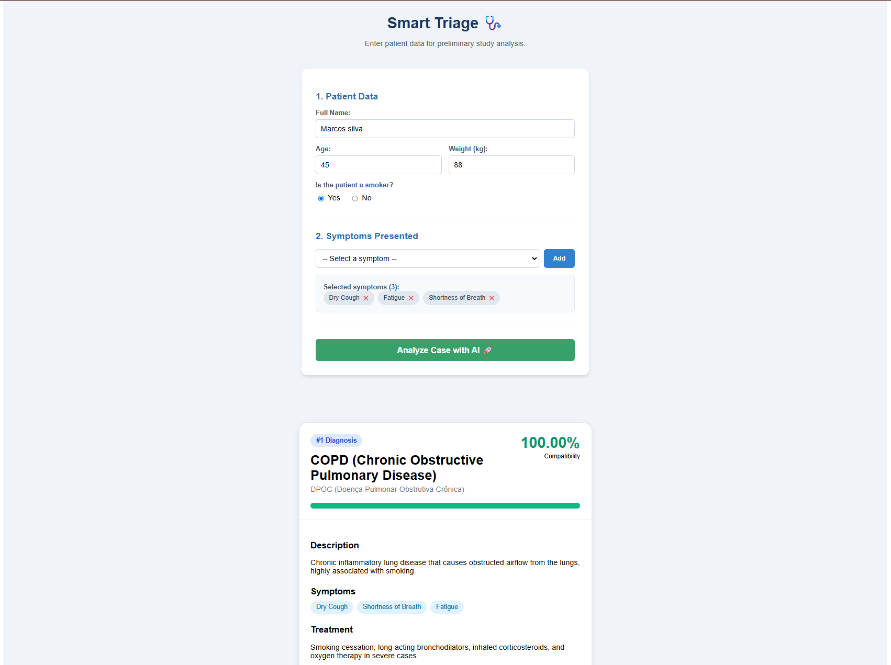
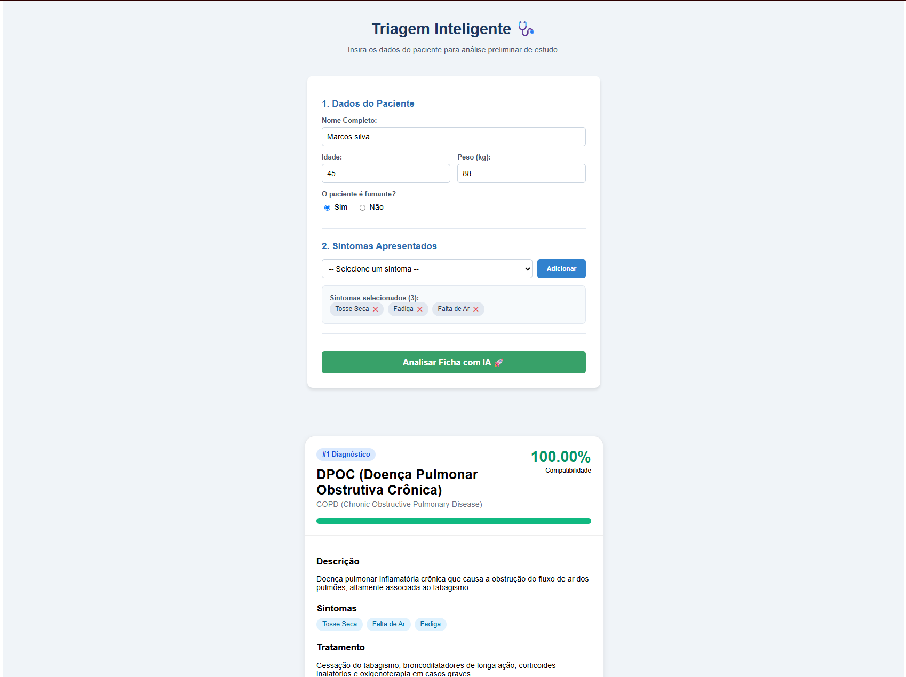

# Sistema de Triagem de Pacientes Inteligente / Intelligent Patient Triage System

[Português](#português) | [English](#english)

---

## English

### 📝 About the Project
This repository was developed as a consolidation project for theoretical concepts regarding Artificial Intelligence development, as part of the postgraduate module started one month ago.

The system is an **intelligent patient triage system** that analyzes reported symptoms to detect potential diseases. The main objective is to apply practical concepts of Software Engineering with Applied AI to optimize pre-medical care workflows and structure intelligent decision pipelines.

### 🖼️ System Demonstration
Below are the visual representations of the system's execution workflow:

#### Execution in English:

---

## Português

### 📝 Sobre o Projeto
Este repositório foi desenvolvido como o projeto de consolidação de conteúdos teóricos sobre a criação de Inteligência Artificial, fazendo parte do módulo do curso de pós-graduação iniciado há um mês. 

O sistema consiste em uma **ferramenta de triagem de pacientes**, capaz de analisar os sintomas informados e detectar possíveis doenças associadas. O objetivo principal é aplicar conceitos práticos de Engenharia de Software com IA para otimizar fluxos de pré-atendimento médico e estruturar pipelines de decisão inteligente.

### 🖼️ Demonstração do Sistema
Abaixo estão as representações visuais do fluxo de execução do sistema em funcionamento:

#### Execução em Português:

---

## 🔗 Link do Repositório / Repository Link
[https://github.com/unipds-engenharia-de-ia-aplicada/engenharia-de-software-com-ia-aplicada](https://github.com/unipds-engenharia-de-ia-aplicada/engenharia-de-software-com-ia-aplicada)
